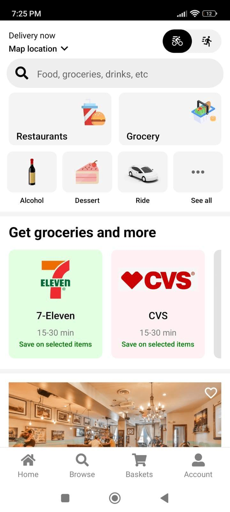
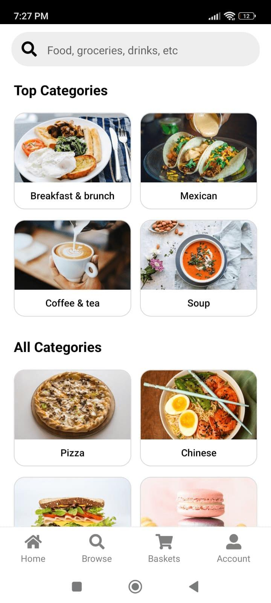
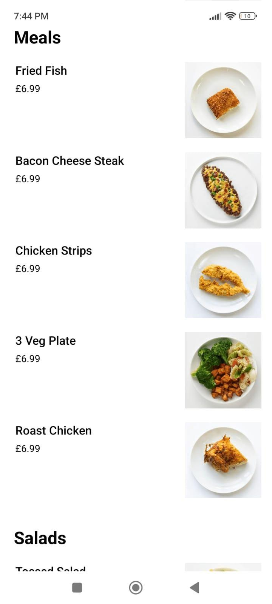
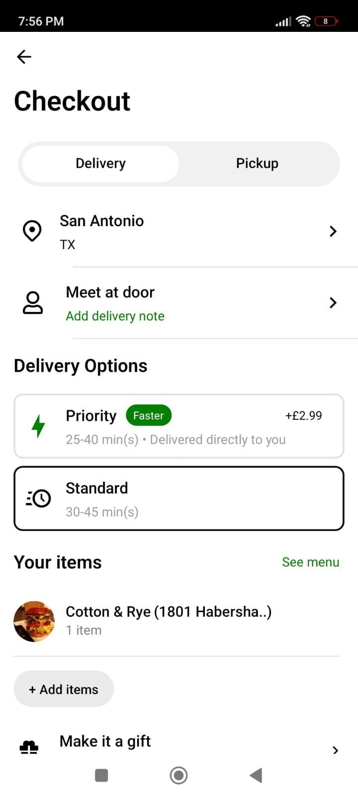

# Food Ordering App

The Food Ordering App is a cross-platform mobile application built with React Native, Redux, JavaScript, and Firebase. It allows users to order food and other necessary items from nearby restaurants, working seamlessly on both Android and iOS devices.

## Key Features

- **Cross-Platform Compatibility**: Runs on both Android and iOS.
- **User Authentication**: Secure login and registration.
- **Browse Restaurants**: View nearby restaurants and their menus.
- **Order Food**: Place orders and track them in real-time.
- **State Management**: Efficient state management with Redux.
- **Firebase Integration**: Real-time database and authentication with Firebase.

## Screenshots










## Installation

1. **Clone the repository**:
   ```bash
   git clone https://github.com/Md-Mursaleen/Food-Ordering-App.git
   
2. **Navigate to the project directory**:
   ```bash
   cd Food-Ordering-App
   
3. **Install dependencies**:
   ```bash
   npm install
   
4. **Set up Firebase**:
   Create a new Firebase project.
   Add your Firebase configuration to firebaseConfig.js.

5. **Start the application**:
   ```bash
   npm start

## Usage

1. **Sign Up / Login**: Create an account or log in.
2. **Browse Restaurants**: Explore nearby restaurants and their offerings.
3. **Order Food**: Add items to your cart and place an order.
4. **Track Orders**: Track your orders in real-time.
5. **Manage Profile**: Update profile information and view order history.

## Contributing

Contributions are welcome! Follow these steps:

1. Fork the repository.
2. Create a new branch:
   ```bash
   git checkout -b feature-branch
3. Make changes and commit them:
   ```bash
   git commit -m 'Add feature'
4. Push to the branch:
   ```bash
   git push origin feature-branch
5. Open a pull request.
